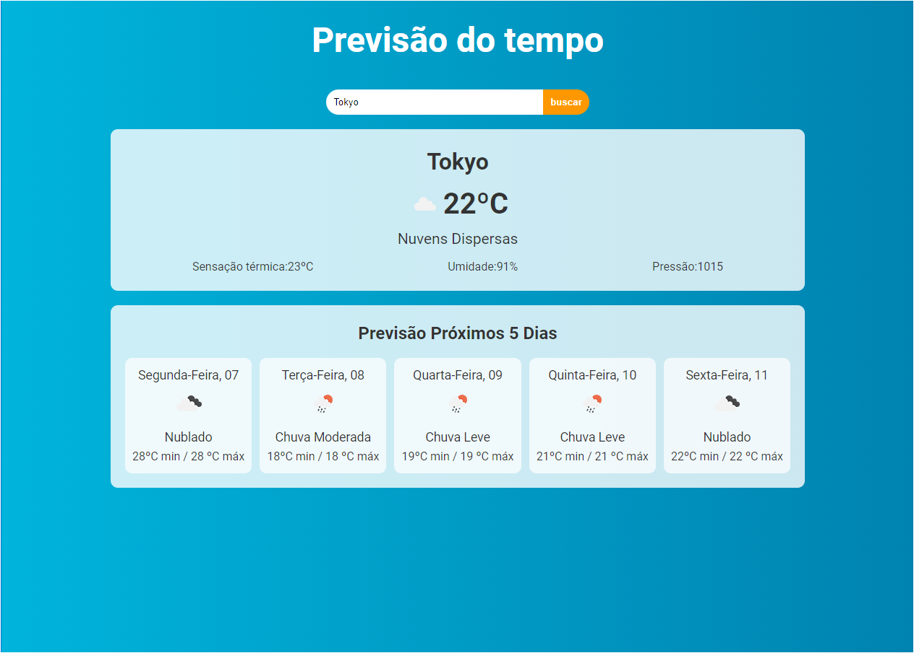

<h1 align="center">Weather Forecast🌦️</h1>

<h2 align="center"><a href="https://weatherprev.netlify.app/">View site</a></h2>

## Index

- <a href="#funcionalidades-do-projeto">project features</a>
- <a href="#como-rodar">How to run this project</a>
- <a href="#tecnologias-ultilizadas">Technologies used</a>
- <a href="#pessoas-autoras">Authors</a>

<h2 id="funcionalidades-do-projeto">Features</h2>

 - [x] fetches current weather data by city
 - [x] also selects the next 5 days to show the forecast
 - [x] uses a weather forecast API
 - [x] handles dates in the project code <br>
 
<h2 id="como-rodar">How to run the project</h2>

``` bash
    # Clone this repository
    $ git clone linkrepo

    # Access the project folder in your terminal
    $ cd weather-forecast

    # Install the dependencies
    $ npm install
    # or
    $ yarn

    # Run the application
    $ npm run dev
    # or
    $ yarn dev
```

<h2 id="tecnologias-ultilizadas">Technologies used</h2>

1. [React](https://react.dev/)
2. [Vite](https://vitejs.dev/)
<h2 id="pessoas-autoras">Authors</h2>  welder barroso
